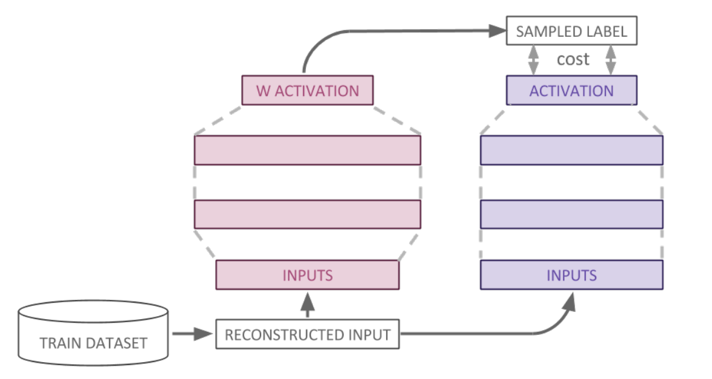
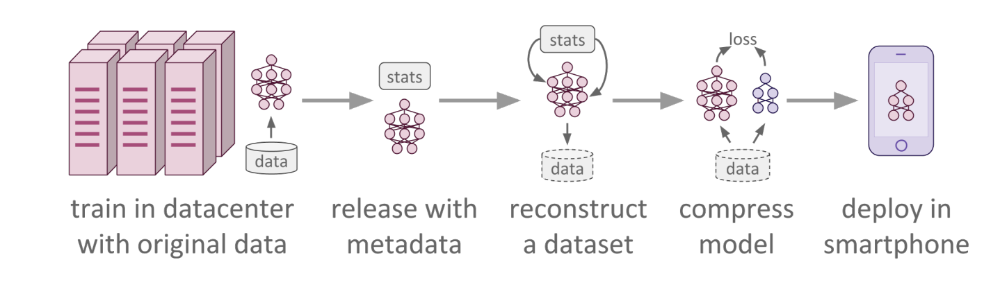

Introduction
------------

Knowledge distillation (KD) is a powerful technique for transferring knowledge from a large, complex "teacher" model to a smaller, more efficient "student" model. 
Traditionally, this process relies on access to the original training data. However, in many real-world scenarios, such as when dealing with sensitive information 
or legacy systems, the original data may be unavailable or inaccessible. Data-free distillation addresses this challenge by synthesizing "surrogate" data directly 
from the teacher model, enabling effective knowledge transfer even in the absence of the original dataset.

**Why Data-Free Distillation?**

- *Data Privacy:* Medical, financial, or user-generated data often cannot be shared due to legal or ethical constraints.
- *Legacy Systems:* Original training data might be lost or corrupted over time.
- *Resource Efficiency:* Generating synthetic data tailored to the teacher’s expertise avoids costly data collection.

The core idea is to reverse-engineer representative samples from the teacher model’s internal representations (e.g., feature statistics, spectral patterns, or 
adversarial examples) and use these to train the student.

Theoretical Background
----------------------

Let :math:`T` be a pre-trained teacher model with parameters :math:`\theta_T`, and :math:`S` a student model with parameters :math:`\theta_S`. Traditional KD minimizes the Kullback-Leibler 
(KL) divergence between the teacher’s and student’s output distributions over a dataset :math:`\mathcal{D} = \{x_i\}_{i=1}^N`:

.. math::

  \mathcal{L}_{\text{KD}} = \mathbb{E}_{x \sim \mathcal{D}} \left[ \text{KL}\left(T(x) \, \| \, S(x)\right) \right]

Here, :math:`T(x)` and :math:`S(x)` are probability distributions of the teacher and student, respectively. This approach requires access to 
:math:`\mathcal{D}`, which becomes problematic when data is unavailable.

**Transition to Data-Free Knowledge Distillation (DFKD)**

In our case, when :math:`\mathcal{D}` is inaccessible, DFKD synthesizes a surrogate dataset :math:`\mathcal{D}' = \{x'_i\}_{i=1}^M` directly from :math:`T`. Therefore, 
the objective generalizes to:

.. math::

  \mathcal{L}_{\text{DFKD}} = \mathbb{E}_{x' \sim \mathcal{D}'} \left[ \text{KL}\left(T(x') \, \| \, S(x')\right) \right]

The key challenge here lies in designing high quality surrogate dataset :math:`\mathcal{D}'` that is able to capture the inherent knowledge of :math:`T`.

DKDF Algorithms
---------------

In our work, we investigate several DKDF algorithms, which are briefly described below: 

- **Statistical Feature Matching**

  Let :math:`\phi_T^l(x)` and :math:`\phi_S^l(x)` denote the activations at layer :math:`l` of :math:`T` and :math:`S`. We synthesize :math:`\mathcal{D}'` by         aligning batch normalization statistics:
  
  .. math::
      
    \min_{x'} \sum_{l} \left( \|\mu_T^l - \mu_S^l(x')\|_2^2 + \|\sigma_T^l - \sigma_S^l(x')\|_2^2 \right),
  
  where :math:`\mu_T^l, \sigma_T^l` are the teacher’s precomputed mean and standard deviation.

  .. image:: images/Statistical.png
     :width: 60%
     :align: center
     :alt: The workflow of Statistical Feature Matching

- **Spectral Feature Matching**

  The idea is similar to the first one, but now, we extend to frequency domain by minimizing the Frobenius norm between Fourier transforms of activations:
  
  .. math::
  
    \min_{x'} \sum_{l} \|\mathcal{F}(\phi_T^l) - \mathcal{F}(\phi_S^l(x'))\|_F^2

  .. image:: images/Spectral.png
     :width: 40%
     :align: center
     :alt: The workflow of Statistical Feature Matching

- **Adversarial Distillation**
- **Deep Inversion**

Our Framework
-------------
We now present the unified framework that allows one to use various specific DFKD algorithms to distill the knowledge from any source without having access 
to the initial data. Our implementation is a library that allows, given a teacher model (and possibly some statistics), to train a distilled student model 
out-of-the-box. The user can utilize any of the above-described algorithms as well as the classical KD approach if the original data is given.
